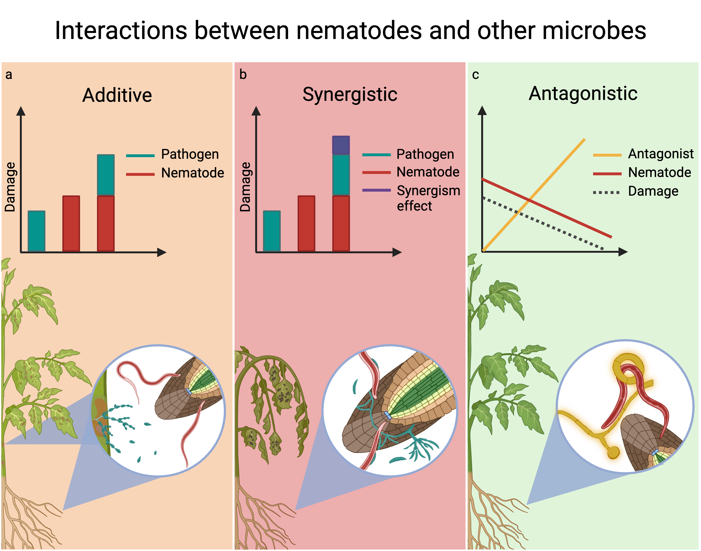

# Illustrations

## Infographic

{fig-align="center" width="100%"}

## In Books

Importance and Principles of Nematode Disease Complexes. In Nematode Disease Complexes in Agricultural Crops. pp 35, 40. CABI. 2025. By Lopez-Nicora, H. D., Costa Silva, E. H., & d’Errico, G.

{width="100%"}
