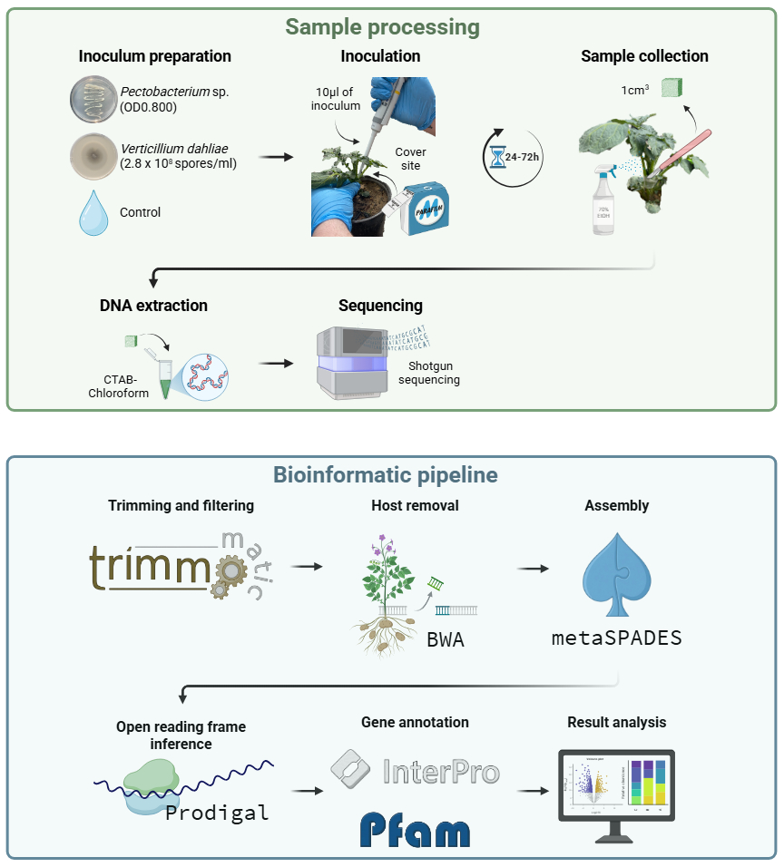

# Projects

## Metagenomics

### *Pectobacterium parmentieri* and *Verticillium dahliae* alter the functional genetic profile of the potato microbiome

This project focuses in understanding the effect of pathogen infection on the microbial genetic profile of potato plants. Shotgun sequencing was used and so far we have identified interesting differences between the microbiome of infected plant when compared to the control. The figure below illustrates the current methodological approach where I have been responsible for the bioinformatic pipeline section. Preliminary results ill be presented during the 2026 One Health Microbiome Symposium poster session in Poster #18.

{fig-align="center" width="100%"}

## Comparative genomics

### Genomic and phenotypic analysis of historic and current *Pectobacterium* species isolated in Pennsylvania

A wide group of *Pectobacterium* spp. are known to cause soft rot of potato. These species are generally region specific, limiting the use of classic taxonomic designations to identify *Pectobacterium* spp. for surveillance. In this project we evaluated genomic and phenotypic characteristics of a Pennsylvania isolate collection dating back to 1992 to identify overlapping features that may help in distinguishing *Pectobacterium* spp. pathogenic potential against potato. This project will soon be published, stay tuned!

## Network analysis

### [Fungal communities shift with soybean cyst nematode abundance in soils](https://apsjournals.apsnet.org/doi/full/10.1094/PBIOMES-02-24-0021-R) {style="color: gray"}

{fig-align="center" width="100%"}

## Foundational statistics

### [Soybean Cyst Nematode Reproduction and Soybean Biomass: The Legacy of Soil Cropping Histories](https://apsjournals.apsnet.org/doi/full/10.1094/PHYTOFR-06-25-0057-R) {style="color: gray"}

{fig-align="center" width="100%"}
